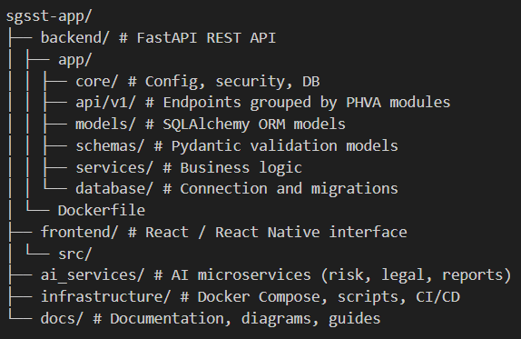

# 🧩 SGSST App  
**Intelligent System for Occupational Safety and Health Management (SG-SST)**  

> _“Digital transformation for workplace safety and compliance.”_

---

## 📖 Overview

**SGSST App** is an intelligent, modular, and scalable platform designed to help companies, contractors, and safety professionals implement and manage their **Occupational Safety and Health Management Systems (SG-SST)** in compliance with national and international standards.

Built using modern open-source technologies (React + FastAPI + PostgreSQL + MinIO), the application integrates **automation**, **data analytics**, and **AI-assisted modules** to optimize planning, monitoring, and continuous improvement processes in workplace safety.

---

## 🧱 Core Features

- ✅ **PHVA Cycle (Plan–Do–Check–Act)** fully digitized  
- 🧠 **AI Microservices** for risk prediction, legal analysis, and report generation  
- 🔒 **Secure authentication and user management** (JWT-based)  
- 🗂️ **Document and file storage** (MinIO / S3 compatible)  
- 📊 **Analytics-ready architecture** for performance indicators (KPI)  
- 🌐 **Multi-platform design** (web + mobile ready via React Native / Expo)  

---

## ⚙️ Technology Stack

| Layer | Technologies |
|-------|---------------|
| **Frontend** | React (Vite) / React Native (Expo) |
| **Backend API** | FastAPI (Python 3.11), SQLAlchemy, Pydantic |
| **Database** | PostgreSQL |
| **Storage** | MinIO (S3-compatible object storage) |
| **AI Services** | FastAPI-based microservices (OpenAI / local LLM integrations) |
| **Infrastructure** | Docker & Docker Compose |
| **Documentation** | OpenAPI (Swagger), Markdown, Mermaid diagrams |

---

## 🧩 Architecture Overview

The platform is organized following a **clean modular structure** and **functional cohesion by aggregate** principle.

This repository is licensed under the Business Source License 1.1 (BUSL-1.1).
All content, including code, diagrams, and documentation, is protected under the terms of this license.